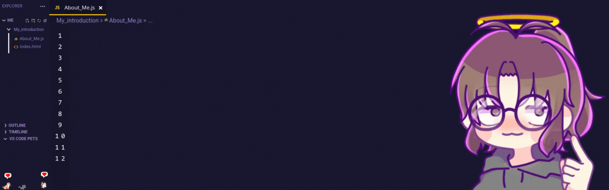

  

★゜・。。・゜゜・。。・゜☆゜・。。・゜゜・。。・゜★

<h1 align="center">👋 Hello, World! I'm Sofia</h1>

Frontend Developer in training, passionate about code, video games 🎮, and cats 🐱. 
I love crafting beautiful and functional interfaces that turn every click into an experience.

★゜・。。・゜゜・。。・゜☆゜・。。・゜゜・。。・゜★

🌸🐾🌸🐾🌸🐾🌸🐾🌸🐾🌸🐾🌸

<h2 align="center">🚀 About Me</h2>

💻 <b>Main stack:</b> HTML, CSS, and JavaScript. 
📚 Currently learning <b>TypeScript</b> and <b>React</b> to take my projects to the next level. 
🐾 My cats sometimes "help" me code (spoiler: it doesn’t compile). 
🎮 Fan of RPGs, simulators, and indie gems. 
🎨 Always aiming to mix design + functionality for unique experiences.

🌸🐾🌸🐾🌸🐾🌸🐾🌸🐾🌸🐾🌸

<h2 align="center">🛠️ Tech & Tools</h2>

  <!-- Kawaii shields personalizados: -->
  
  
  
  
  

🌟🌟🌟🌟🌟🌟🌟🌟🌟🌟

<h2 align="center">📌 Featured Projects</h2>

🐾 <b>Cat Profile Web</b>: A page to showcase cat profiles and fun facts (HTML, CSS, JS). 
🎮 <b>Pixel UI</b>: A retro video game–inspired interface built with HTML & CSS. 
🌐 <b>Personal Portfolio</b>: Responsive portfolio website to showcase my projects and skills. 
<i>(Check out more in my repositories 👀)</i>

💐💐💐💐💐💐💐💐💐💐

<h2 align="center">🌱 Currently Learning</h2>

React Hooks and reusable components. 
TypeScript for better code quality. 
Best practices for responsive design.

🌸🌼🌸🌼🌸🌼🌸🌼🌸🌼

<h2 align="center">💌 Connect With Me</h2>

🐾✨🐾✨🐾✨🐾✨🐾✨

<h3 align="center">✨ Fun Fact</h3>

My code has more late-night commits than daytime ones. 
Probably because my cats and my video games don’t understand “office hours” 😸🎮.

🐾✨🐾✨🐾✨🐾✨🐾✨

