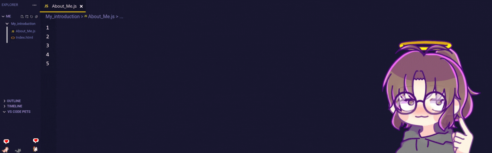

  

# 👋 Hello, World! I'm Sofia  

> Frontend Developer in training, passionate about code, video games 🎮, and cats 🐱.  
> I love crafting beautiful and functional interfaces that turn every click into an experience.

---

## 🚀 About Me
- 💻 **Main stack:** HTML, CSS, and JavaScript.
- 📚 Currently learning **TypeScript** and **React** to take my projects to the next level.
- 🐾 My cats sometimes "help" me code (spoiler: it doesn’t compile).
- 🎮 Fan of RPGs, simulators, and indie gems.
- 🎨 Always aiming to mix design + functionality for unique experiences.

---

## 🛠️ Tech & Tools

---

## 📌 Featured Projects
- 🐾 **Cat Profile Web**: A page to showcase cat profiles and fun facts (HTML, CSS, JS).
- 🎮 **Pixel UI**: A retro video game–inspired interface built with HTML & CSS.
- 🌐 **Personal Portfolio**: Responsive portfolio website to showcase my projects and skills.

*(Check out more in my repositories 👀)*

---

## 🌱 Currently Learning
- React Hooks and reusable components.
- TypeScript for better code quality.
- Best practices for responsive design.

---

## 💌 Connect With Me

---

### ✨ Fun Fact
> My code has more late-night commits than daytime ones.  
> Probably because my cats and my video games don’t understand “office hours” 😸🎮.
